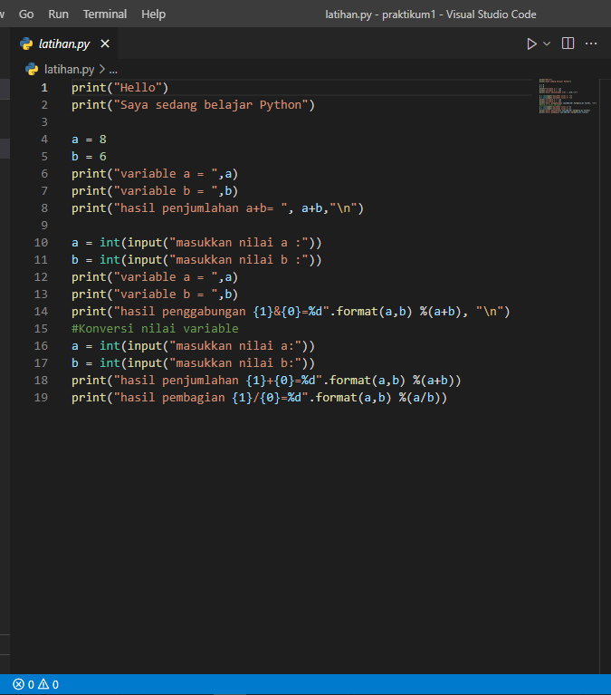
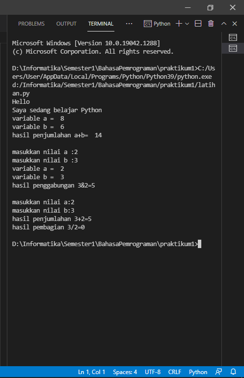
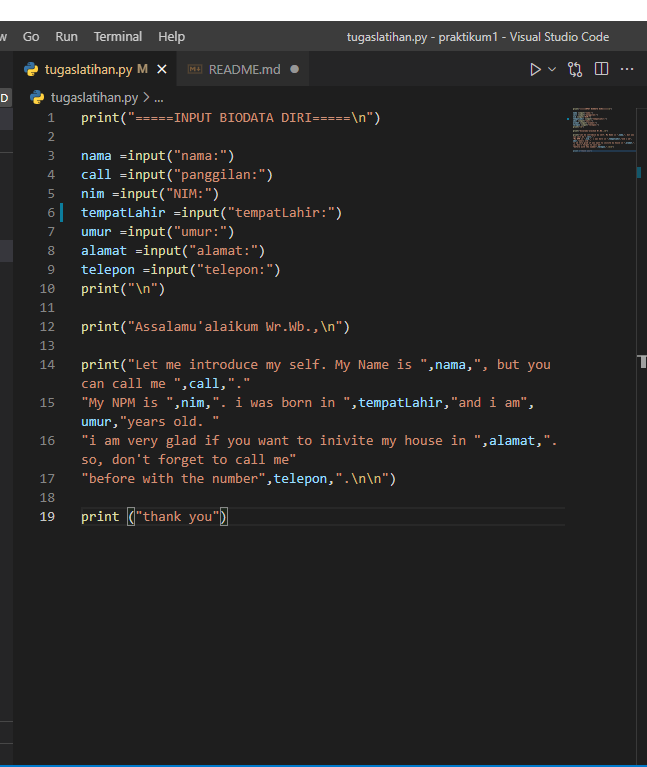

# praktikum1

## Belajar pemrograman python

### Membuat Program input angka
buatlah code program di vscode seperti di gambar, lalu save dengan extensi python

Lalu run programnya, maka akan muncul hasil seperti berikut

### Membuat program input biodata dan introducing
buatlah code program seperti ini, save dengan ekstensi python
